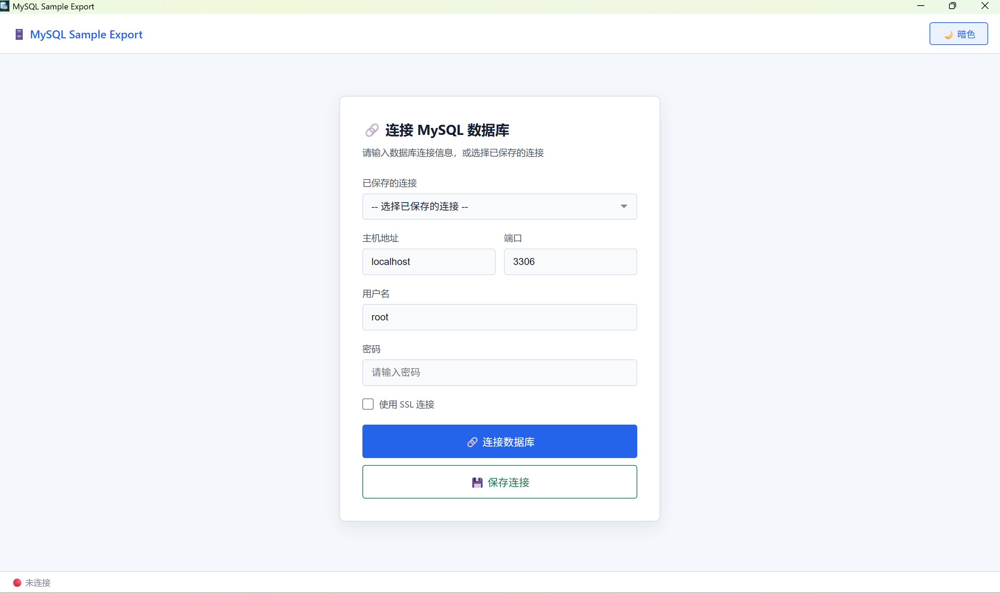

# MySQL Sample Export

> 从 MySQL 数据库导出表结构与样例数据，为 AI Agent 提供精准上下文，避免全量数据塞爆窗口。

[](https://github.com/rurubudong1211/mysql-sample-export/releases)
[](./LICENSE)
[](https://github.com/rurubudong1211/mysql-sample-export/releases)

## ✨ 项目亮点

- **为 AI Agent 而生** — 导出表结构 + 少量样例数据（默认 10 条），让 Agent 理解字段含义、枚举值、空值分布和真实数据形态，不浪费上下文窗口。
- **敏感数据自动脱敏** — 自动识别手机号、密码等敏感字段，导出时替换为 `****` 或 `138****5678` 格式，无需手动清洗。
- **灵活的导出控制** — 每张表可独立选择"只导出样例数据"或"导出全量数据"；全量导出超过 10 万行时二次确认。
- **四种导出格式** — 支持 SQL（建表 + INSERT）、JSON（结构化元数据）、CSV（逗号分隔）、Markdown（文档友好表格）。
- **轻量桌面工具** — 基于 Tauri 2 + Rust 构建，无需 Docker，无需命令行，点开即用。
- **适合场景** — 开发人员向 AI 编程助手提供数据库 schema 上下文；DBA 快速导出表定义和样本做文档；团队协作时分享数据结构快照。

## 📦 安装

### 直接下载（推荐）

前往 [Releases](https://github.com/rurubudong1211/mysql-sample-export/releases) 页面下载最新版本：

- **MSI 安装包**：`MySQL Sample Export_x.x.x_x64.msi`，双击安装
- **便携版**：`MySQL Sample Export_x.x.x_x64-Portable.zip`，解压即用，无需安装

### 从源码构建

```bash
# 1. 安装依赖
npm install

# 2. 启动开发模式
npm run dev

# 3. 构建并打包
npm run build
```

构建产物位于 `src-tauri/target/release/bundle/`。

> 构建环境要求：Node.js 18+、Rust 1.77+、Windows 10/11。

## 🖼️ 界面预览



## 🚀 快速开始

1. 打开 MySQL Sample Export，填写连接信息（host、port、user、password），可选开启 SSL。
2. 连接成功后自动加载业务数据库列表（自动过滤 `information_schema` 等系统库）。
3. 点击目标数据库，浏览其中的表与视图。
4. 点击单张表查看**表结构**、**样例数据**和**建表语句**预览。
5. 点击 **导出数据**，选择导出格式（SQL / JSON / CSV / Markdown），调整样例行数（1-1000），选择 Sample 或全量模式，保存文件。
6. 将导出文件内容粘贴给 AI Agent，辅助分析需求、生成 SQL 或编写后端接口。

## 🧭 导出格式示例

### SQL 格式

```sql
-- ============================================
-- Database: mydb
-- Table: users
-- Export Mode: sample
-- Export Time: 2026-07-02 16:05:02
-- Export By: MySQL Sample Export
-- ============================================

-- 表结构
CREATE TABLE `users` (
  `id` int NOT NULL AUTO_INCREMENT,
  `name` varchar(50) NOT NULL,
  `mobile_phone` varchar(20) DEFAULT NULL,
  `password` varchar(255) DEFAULT NULL,
  PRIMARY KEY (`id`)
);

-- 样例数据 (前 10 条)
INSERT INTO `users` (`id`, `name`, `mobile_phone`, `password`) VALUES (1, '张三', '138****5678', '******');
INSERT INTO `users` (`id`, `name`, `mobile_phone`, `password`) VALUES (2, '李四', '139****1111', '******');
```

### Markdown 格式

```markdown
# mydb.users

> 导出时间: 2026-07-02T08:05:02Z
> 导出模式: Sample

## 表结构

| 字段 | 类型 | 允许为空 | 键 | 默认值 | 额外 | 注释 |
|------|------|---------|-----|--------|------|------|
| id | int | NO | PRI | NULL | auto_increment | 用户ID |
| name | varchar(50) | NO | | NULL | | 用户名 |
| mobile_phone | varchar(20) | YES | | NULL | | 手机号 |

## 样例数据 (前 10 条)

| id | name | mobile_phone |
|----|------|-------------|
| 1 | 张三 | 138****5678 |
| 2 | 李四 | 139****1111 |
```

## 📁 项目结构

```text
src/                         # React 前端（TypeScript + Vite）
├── components/              # 页面组件
│   ├── ConnectionForm.tsx   # 连接表单与历史连接管理
│   ├── DatabaseList.tsx     # 数据库列表浏览
│   ├── TableList.tsx        # 表/视图列表，支持批量导出
│   ├── TableDetail.tsx      # 表结构查看、样例数据预览
│   └── ExportDialog.tsx     # 导出对话框，格式选择、模式切换
├── api.ts                   # Tauri invoke 桥接层
├── types.ts                 # 前端类型定义
├── App.tsx                  # 应用入口与视图路由
├── App.css                  # 全局样式（含亮色/暗色主题）
└── main.tsx                 # React 挂载入口

src-tauri/                   # Tauri 桌面端配置与 Rust 后端
├── src/
│   ├── main.rs              # Tauri 入口
│   ├── lib.rs               # 命令注册与状态管理
│   ├── database.rs          # MySQL 连接、查询、导出核心逻辑
│   ├── connections.rs       # 连接历史持久化（本地 JSON）
│   └── types.rs             # Rust 侧类型定义
├── tauri.conf.json          # Tauri 主配置
├── Cargo.toml               # Rust 依赖
├── capabilities/            # Tauri 权限声明
├── icons/                   # 应用图标
└── wix/                     # Windows MSI 打包模板与中文本地化

scripts/                     # Windows 打包辅助脚本
```

## 🛠️ 开发

```bash
# 安装依赖
npm install

# 启动 Tauri 桌面开发版（含热更新）
npm run dev

# 仅启动前端开发服务器（http://127.0.0.1:5173）
npm run dev:renderer

# TypeScript 类型检查 + Vite 构建
npm run build:renderer

# 运行 Rust 单元测试
cd src-tauri && cargo test

# 格式化 Rust 代码
cd src-tauri && cargo fmt
```

## ❓ 适用场景

| 场景 | 说明 |
|------|------|
| **AI 编程辅助** | 将表结构与样例数据提供给 Claude、ChatGPT 等 Agent，让 AI 准确理解业务数据模型，生成靠谱的 SQL、接口代码。 |
| **数据库文档** | 快速生成 Markdown 格式的表结构文档，包含字段注释和样例数据，适合团队协作。 |
| **开发联调** | 从开发库导出结构和样本数据，分享给前端或测试同事，无需共享完整数据库。 |
| **代码审查** | 为 PR 附上相关表的结构快照，帮助 reviewer 快速理解 schema 变更。 |

## 🔒 安全说明

- 连接信息保存在 exe 同级目录下的 `connections.json`，密码以 **Base64 编码**（非加密），仅防明文泄露。
- **请勿**将包含真实凭据的 `connections.json` 提交到 Git 或公开分享。
- SSL 选项当前跳过证书域名校验，不等同于生产级 TLS 校验。
- 导出数据中的手机号、密码字段**自动脱敏**，有效降低数据泄露风险。

## 🤝 贡献

欢迎提交 Issue 和 PR。请保持代码风格一致，Rust 使用 `cargo fmt` 格式化，前端使用 TypeScript strict 模式。

## 📝 License

[MIT License](./LICENSE)
